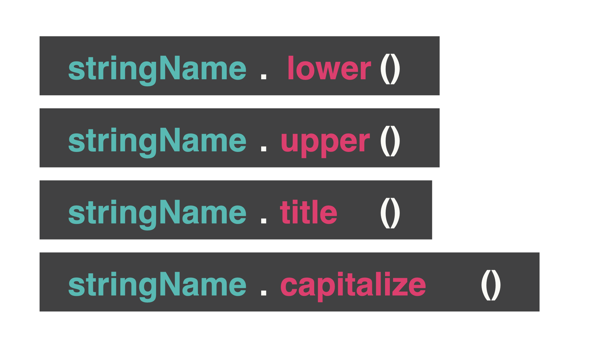

# String Manipulation

Let's do some string manipulation to make `if` statements even easier.

👉 Does this code look familiar from the insult generator project?
```python
name = input("What's your name? ")
if name == "David" or name == "david":
  print("Hello Baldy!")
else: 
  print("What a beautiful head of hair!")
```
Right now, if the user writes "DAVID" or "david", the `if` statement works correctly. However, "DaVID" does not give the correct output. 

To the computer, " david", "dAviD", and "david" are completely different. 

To simplify what the user typed in, we can add these functions to the *end* of the name of the variable:



- `.lower` = all letters are lower case
- `.upper`  = all letters are upper case
- `.title` = capital letter for the first letter of every word
- `.capitalize` = capital letter for the first letter of *only* the first word

## lower
👉 The computer is converting everything to lowercase before it compares my `if` statements. 

*You need to type your `if` statement in lower case when you use `.lower`. The `if` statement needs to be written in upper case when you use `.upper`, etc.*
```python
name = input("What's your name? ")
if name.lower() == "david": 
  print("Hello Baldy!")
else: 
  print("What a beautiful head of hair!")
```

## What if we put a space first? 

Adding `.strip()` removes any spaces on either side of the word.

👉 We can chain these functions together.
```python
name = input("What's your name? ")
if name.lower().strip() == "david": 
  print("Hello Baldy!")
else: 
  print("What a beautiful head of hair!")
```


### Try it out!


